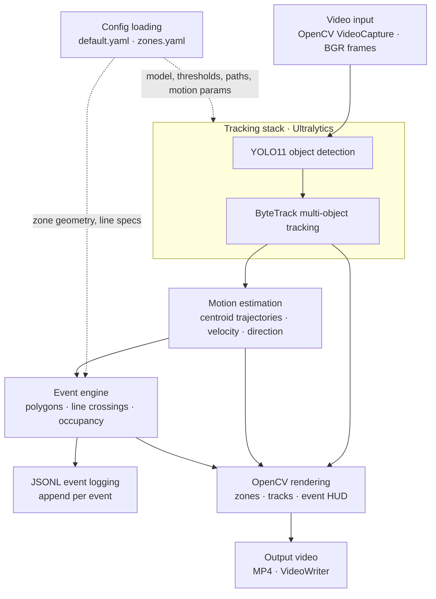

# Real-Time Vision Intelligence System

Production-style real-time computer vision pipeline for object detection, multi-object tracking, motion estimation, event reasoning, and live streaming.

Built to simulate how modern perception systems work in real-world environments such as smart surveillance, traffic analytics, industrial monitoring, robotics, and edge AI systems.

---

## Documentation

Technical documentation for the implemented pipeline (`run_detection.py`, `app/core/`, `configs/`):

- [Architecture](docs/architecture.md) — modules, data flow, temporal state
- [Pipeline flow](docs/pipeline_flow.md) — per-frame lifecycle
- [Tracking and motion](docs/tracking_and_motion.md) — ByteTrack, centroids, velocity, limitations
- [Event engine](docs/event_engine.md) — zones, lines, occupancy, JSON schema
- [Technical FAQ](docs/technical_faq.md) — design tradeoffs and scaling notes
- [Debugging guide](docs/debugging_guide.md) — common failures and instrumentation
- [Design decisions](docs/design_decisions.md) — engineering rationale

---

## Features

- Real-time object detection
- Multi-object tracking with persistent IDs
- Motion and trajectory estimation
- Speed and direction analysis
- Event triggering system
- Live annotated video streaming
- REST API endpoints
- Config-driven architecture
- Performance benchmarking
- Docker-ready deployment

---

## Tech Stack

### Core ML / CV

- Python
- OpenCV
- PyTorch
- YOLO
- ByteTrack

### Backend

- FastAPI
- WebSockets

### Streaming / Visualization

- Streamlit
- OpenCV video pipelines

### Deployment

- Docker
- ONNX Runtime

---

## Example Use Cases

- Traffic monitoring
- Warehouse analytics
- Retail occupancy tracking
- Industrial safety systems
- Drone perception pipelines
- Smart city analytics

---

## System Architecture

Implemented pipeline (`run_detection.py`): one synchronous frame loop. YOLO11 detection and ByteTrack association run inside a single `YOLO.track(..., persist=True)` call; the diagram shows them as logical stages.



---

## Current Capabilities

- Detect and track multiple objects in real time
- Maintain consistent object identities across frames
- Estimate:
  - velocity
  - direction
  - trajectories
- Trigger events such as:
  - line crossing
  - stationary objects
  - region entry/exit
- Stream annotated frames live

---

## Repository Structure

```text
project/
│
├── app/
│   ├── core/
│   ├── api/
│   ├── services/
│   └── utils/
│
├── configs/
├── models/
├── outputs/
├── scripts/
├── tests/
└── docker/
```

---

## Roadmap

### Phase 1

- Basic detection pipeline
- Video inference
- Tracking integration

### Phase 2

- Motion estimation
- Event reasoning
- API layer

### Phase 3

- Dashboard and monitoring
- Edge deployment optimization
- Multi-camera support

### Phase 4

- Distributed streaming
- Cloud deployment
- Advanced analytics

---

## Goals of This Project

This project is designed to demonstrate:

- Real-world ML engineering
- Applied computer vision systems
- Production-style architecture
- Streaming and low-latency inference
- End-to-end perception pipelines

---

## Installation

```bash

git clone <repo-url>

cd project

pip install -r requirements.txt

```

---

## Run

```bash

python [run.py](http://run.py)

```

Or:

```bash

uvicorn app.main:app --reload

```

---

## Status

Active development.

This project is being built incrementally with a focus on:

- clean architecture
- scalability
- reproducibility
- deployment readiness

---

## License

MIT License