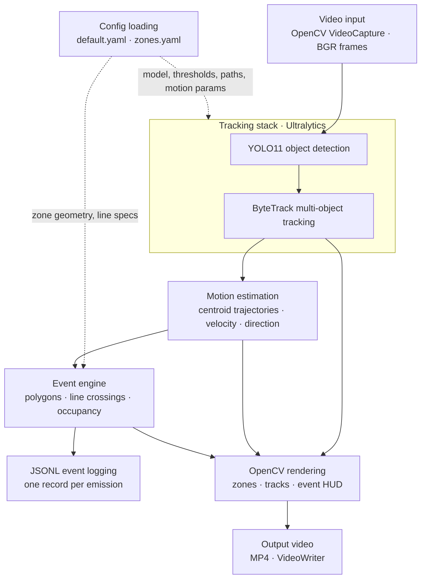

# Real-Time Vision Intelligence

End-to-end **video perception pipeline**: YOLO11 detection, ByteTrack multi-object tracking, centroid-based motion estimation, and a **rule-based event engine** that turns tracks into structured analytics (zones, line crossings, occupancy). Outputs are **annotated MP4** plus **JSONL** suitable for downstream storage, alerting, or batch analytics.

This repository is a **focused reference implementation** of how deployed vision systems are layered: neural inference for appearance, temporal association for identity continuity, geometric reasoning for policy, and explicit **event contracts** for anything that is not “raw boxes.” It is built for engineers who need a clear seam between **perception** and **product logic**—not a single-script detector demo.

**Current deployment shape:** a deterministic, synchronous **frame loop** over a video file (`run_detection.py`), YAML-driven configuration, and append-only JSON records per emitted event. That pattern maps directly to production variants (RTSP workers, edge containers, GPU batch jobs) by swapping the I/O front-end while keeping the same module boundaries.

---

## Why this project exists

Industrial vision products rarely stop at bounding boxes. They must answer questions that require **time**: Did a person enter a controlled area? Did a vehicle cross a counting line? How many objects are inside a region *right now*, and when did that count last change?

This codebase shows **how those questions are answered in software**: tracker state for IDs, short centroid history for motion, finite-state memory for edge-triggered rules, and a **stable JSON schema** so analytics and compliance tooling do not depend on OpenCV draw calls. It exists to demonstrate **perception engineering**—composition, temporal consistency, and explicit outputs—not notebook-style inference snippets.

---

## Implementation status (today)

| Layer | Status | Notes |
|--------|--------|--------|
| Object detection | Implemented | YOLO11 via Ultralytics (`YOLO.track` path). |
| Multi-object tracking | Implemented | ByteTrack (`bytetrack.yaml`), `persist=True` for cross-frame state. |
| Motion / trajectory | Implemented | Per-track centroid deque, finite-difference velocity, cardinal direction. |
| Event engine | Implemented | Polygons, line segments, occupancy; JSONL + on-frame HUD. |
| Configuration | Implemented | `configs/default.yaml`, `configs/zones.yaml`. |
| Documentation | Implemented | `docs/` (architecture, pipeline, tracking, events, FAQ, debugging, design). |
| Live streaming / REST / Web UI | Not implemented | Natural extensions; pipeline is I/O-agnostic at the edges. |

The runnable entry point is **`python run_detection.py`**. Optional module `app/core/detector.py` exposes detection-only (`predict`) for experiments; the main pipeline uses **`ByteTrackTracker`** (detect + associate in one call).

---

## Perception pipeline

Each decoded frame passes through a **fixed ordering** of stages:

1. **Decode** — BGR frame from `cv2.VideoCapture`.
2. **Detect + associate** — `YOLO.track(..., persist=True, tracker="bytetrack.yaml")` produces boxes with stable `track_id` when tracking succeeds.
3. **Motion** — Append bbox centroid `(x, y)` at timeline `t = frame_index / fps`; estimate instantaneous velocity and direction from the last two samples.
4. **Events** — Evaluate polygon inclusion, segment–line intersection (previous vs current centroid), and zone occupancy; emit structured dicts when rules fire.
5. **Persist / render** — Write one JSON line per event; draw zones, trajectories, boxes, and a short rolling event list on the frame; encode to MP4.

Timeline timestamps are **derived from frame index and container FPS**, not wall clock—reproducible on file replays and aligned with exported video timecode.

---

## Temporal reasoning and event-driven analytics

**Temporal reasoning** here means: decisions depend on **state carried across frames**, not only on the current detection list.

- **Tracker state** (inside Ultralytics / ByteTrack): Kalman and assignment logic maintain identities across occlusion and score flicker when `persist=True`.
- **Motion history** (`MotionEstimator`): bounded deque of `(t, x, y)` per `track_id`; velocity is a discrete derivative over the sampling grid implied by FPS.
- **Event memory** (`EventEngine`): e.g. last inside/outside per `(track_id, zone_id)` for rising-edge zone entry; pending flags for line crossings until the centroid path “uncrosses”; last occupancy count per zone to emit only on **change**.

**Event-driven analytics** means downstream systems consume **discrete records** (who / what / where / when in `details`) instead of parsing pixels or raw tracks. That is the same contract used in production: message bus, warehouse, SIEM, or data lake ingestion—all keyed off immutable event payloads.

---

## Implemented event types

| Type | Trigger | `track_id` |
|------|---------|------------|
| `zone_entry` | Centroid transitions from outside → inside a YAML-defined polygon. | Per object |
| `line_crossing` | Segment from previous to current centroid intersects a YAML-defined line; re-arms after uncross. | Per object |
| `occupancy_count` | Integer count of tracked objects inside a monitored zone **changes** (or first observation). | `null` (aggregate) |

There is **no** `zone_exit` in the current engine; line crossing does not yet encode direction (A-side vs B-side) in `details`.

### Example JSON event (`line_crossing`)

```json
{
  "event_id": "a3f2c8b1-4e9d-4c2a-9f61-0b2d8e7c6a54",
  "timestamp": 12.48,
  "type": "line_crossing",
  "track_id": 1847,
  "label": "person",
  "details": {
    "line_id": "divider",
    "line_name": "Vertical divider",
    "previous_centroid": [612.4, 310.2],
    "current_centroid": [668.1, 315.8]
  }
}
```

Events are written as **JSONL** (one JSON object per line). Each run opens the configured output path in **write** mode (file truncated at start); see `docs/technical_faq.md` for append-only production patterns.

---

## System architecture

Logical stages match the code layout: inference (`app/core/tracker.py`), motion (`app/core/motion.py`), rules (`app/core/events.py`), orchestration and I/O (`run_detection.py`). YOLO11 detection and ByteTrack run inside a **single** `YOLO.track()` invocation; the diagram separates them as conceptual stages.



---

## Key engineering concepts demonstrated

- **Layered perception stack** — Separate modules for association (`ByteTrackTracker`), kinematic summaries (`MotionEstimator`), and policy (`EventEngine`), composed in one process without circular imports.
- **Stable identity under noise** — ByteTrack + `persist=True`; explicit handling of `track_id == -1` when association does not assign an ID.
- **Explicit event contract** — UUID `event_id`, video-aligned `timestamp`, typed `details` maps for analytics pipelines.
- **Edge vs level triggers** — Zone entry on **rising edge**; occupancy on **count delta**; line crossing with **re-arm** semantics to avoid duplicate fires during sustained intersection.
- **Configuration as data** — ROI geometry and thresholds live in YAML; code stays generic.
- **Deterministic replay** — Frame-index timebase for comparable runs across machines (given the same inputs and dependency versions).
- **Operational observability hooks** — Trajectory and speed overlaid on video for human verification against JSONL (standard debug loop for perception teams).

---

## Technology stack

Pinned versions live in `requirements.txt`. Core runtime dependencies for the pipeline:

| Component | Role |
|-----------|------|
| Python 3.11+ (recommended) | Runtime |
| PyTorch `2.11.0` | YOLO inference backend |
| Ultralytics `8.4.48` | YOLO11 + `track()` + ByteTrack integration |
| OpenCV `4.13.x` | Decode/encode, geometry (`pointPolygonTest`), drawing |
| NumPy `2.4.x` | Array interchange |
| PyYAML `6.0.x` | `default.yaml` / `zones.yaml` |
| `lap` | Assignment in tracker (Ultralytics / ByteTrack dependency) |

Other packages in `requirements.txt` are **transitive** to the pinned Ultralytics and PyTorch wheels; the application Python sources under `app/` and `run_detection.py` use OpenCV, NumPy, PyYAML, and Ultralytics on the hot path.

---

## Repository structure (current)

```text
real-time-vision-intelligence/
├── run_detection.py          # Composition root: I/O, pipeline order, JSONL + MP4
├── requirements.txt
├── README.md
├── configs/
│   ├── default.yaml          # Model, thresholds, paths, motion hyperparameters
│   └── zones.yaml            # Polygons, lines, optional occupancy zone list
├── app/
│   └── core/
│       ├── tracker.py        # ByteTrackTracker, TrackedObject
│       ├── motion.py         # MotionEstimator, TrackMotionState, directions
│       ├── events.py         # EventEngine, zone/line loaders, OpenCV overlays
│       └── detector.py       # Optional: YOLO-only ObjectDetector
└── docs/
    ├── architecture.md
    ├── pipeline_flow.md
    ├── tracking_and_motion.md
    ├── event_engine.md
    ├── technical_faq.md
    ├── debugging_guide.md
    └── design_decisions.md
```

Sample media and outputs are expected under `data/` (see `configs/default.yaml` paths); that directory may be gitignored or populated locally.

---

## Real-world use cases

These map to **implemented** primitives (zones, lines, counts, tracks)—deployment would add cameras, auth, retention, and SLAs.

- **Access and safety zones** — Rising-edge entry into a restricted polygon (PPE zones, machinery envelopes).
- **People or vehicle counting** — Line crossing with dedupe semantics; occupancy for queue or lobby density.
- **Operational analytics** — JSONL into warehouse / lakehouse for dashboards (dwell and exit are extensions).
- **Incident reconstruction** — Annotated MP4 plus JSONL for audit trails aligned on the same timeline.
- **Edge validation** — Offline clip regression before promoting model or zone configs.

---

## Installation

```bash
git clone <repository-url>
cd real-time-vision-intelligence
python -m venv .venv
source .venv/bin/activate   # Windows: .venv\Scripts\activate
pip install -r requirements.txt
```

Configure `configs/default.yaml` (input/output paths, model weights) and `configs/zones.yaml` (pixel coordinates must match frame resolution).

---

## Run

```bash
python run_detection.py
```

Artifacts:

- Annotated video at `output_video` (see config).
- JSONL at `events_output` (see config).

---

## Documentation

| Document | Contents |
|----------|----------|
| [Architecture](docs/architecture.md) | Modules, data flow, temporal state |
| [Pipeline flow](docs/pipeline_flow.md) | Frame-by-frame lifecycle |
| [Tracking and motion](docs/tracking_and_motion.md) | ByteTrack, `persist`, velocity limits |
| [Event engine](docs/event_engine.md) | Rules, dedupe, JSON schema |
| [Technical FAQ](docs/technical_faq.md) | Tradeoffs, scaling, latency |
| [Debugging guide](docs/debugging_guide.md) | Failures, codecs, tracker instability |
| [Design decisions](docs/design_decisions.md) | Rationale and MVP boundaries |

---

## Planned future work

Ordered roughly by how often it appears in production roadmaps for similar systems:

1. **Live ingress** — RTSP / GStreamer decode, optional wall-clock and frame PTS in each event, backpressure-aware queues.
2. **Service boundary** — gRPC or HTTP ingest of frames or clips; authn/z for callbacks; schema versioning on events.
3. **Richer semantics** — `zone_exit`, directional line crossing, dwell time, class-filtered rules, optional foot-point or homography for metric speed.
4. **Ops hardening** — Structured logging, per-stage latency metrics, health endpoints, graceful shutdown, JSONL append with rotation.
5. **Multi-camera** — One worker per stream, shared weight store, `camera_id` on every record, optional cross-camera correlation (out of scope until single-stream is hardened).
6. **CI and regression** — Golden JSONL on synthetic geometry fixtures; pinned golden videos for tracker drift smoke tests.
7. **Export and deployment** — ONNX / TensorRT builds, container images, orchestration manifests (Kubernetes / edge device profiles).

---

## License

MIT License
